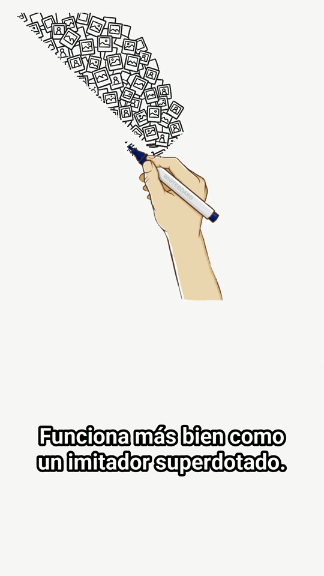
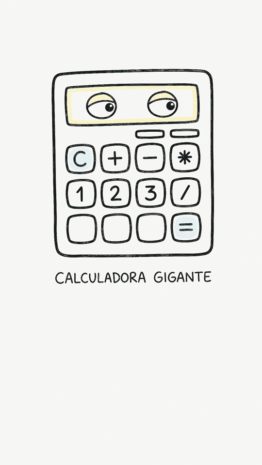
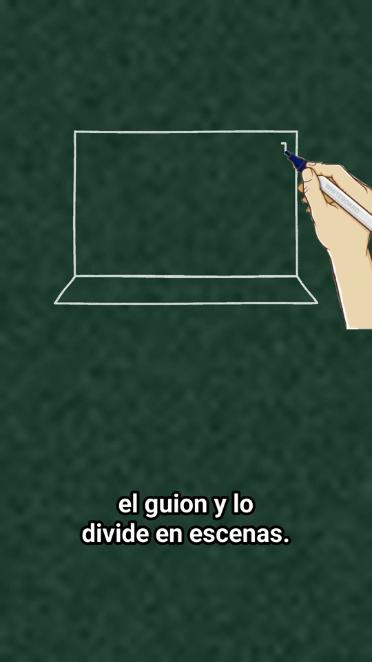
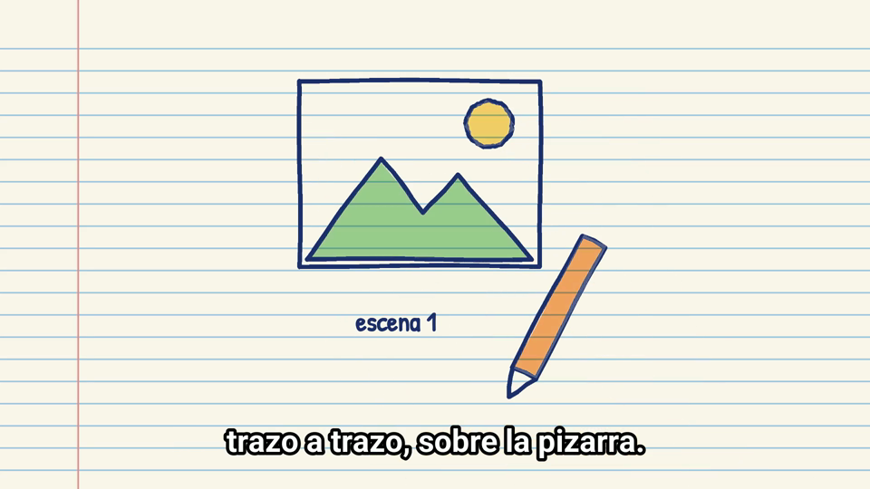

# Pizarra IA

**Vídeos de pizarra (whiteboard) dibujados a mano, con tu propia clave de Gemini.**

<table>
<tr>
<td align="center"><a href="examples/demo-ia-explicada-9x16.mp4"></a><br><sub><b>Con Gemini</b> · «Cómo funciona la IA explicado fácil»<br><a href="examples/demo-ia-explicada-9x16.mp4">ver vídeo con sonido</a></sub></td>
<td align="center"><a href="examples/demo-offline-9x16.mp4"></a><br><sub><b>Modo sin clave</b> (demo offline)<br><a href="examples/demo-offline-9x16.mp4">ver vídeo con sonido</a></sub></td>
</tr>
</table>

Pruébalo online gratis en **[tools.iaquetrabaja.com/pizarra](https://tools.iaquetrabaja.com/pizarra/)** (cuenta gratuita).

### Coste y tiempo aproximados (por 1 minuto de vídeo)

| | Con clave de pago (imágenes de Gemini) | Con clave gratuita |
|---|---|---|
| Guion (gemini-3.8-flash) | ~0,01 $ | 0 $ (cuota gratis) |
| ~8 ilustraciones (gemini-3.1-flash-image, 0,067 $/imagen) | ~0,54 $ | 0 $ — se dibujan como vectores con el modelo de texto |
| Voz, 60 s (gemini-3.8-flash-tts) | ~0,02 $ | 0 $ (cuota gratis) o voz local Piper |
| **Total** | **≈ 0,55 $ (≈ 0,50 €)** | **0 €** |
| **Tiempo de generación** | **≈ 2–3 min** (≈ 1 min de IA + ≈ 1 min de render en 2 núcleos de CPU) | ≈ 2–3 min |

Precios de la API de Gemini a octubre de 2026 (tarifas de texto y voz que Google duplica a partir del 1 de enero de 2027). Las imágenes de Gemini no tienen cuota gratuita: con una clave gratuita Pizarra IA usa automáticamente ilustraciones vectoriales. Unas 13–20 llamadas a la API por vídeo.

Escribes un tema y Pizarra IA:

1. escribe el guion y lo divide en escenas (opcionalmente investigando en la web),
2. te deja **revisarlo y editarlo** antes de gastar nada más,
3. dibuja una ilustración de pizarra para cada escena,
4. la anima **trazo a trazo con una mano que sigue la punta del rotulador** y la colorea al final,
5. le pone voz (Gemini TTS o, gratis y local, Piper),
6. añade subtítulos grandes y legibles (y exporta el `.srt`),
7. y monta el MP4 en vertical 9:16 (TikTok, Reels, Shorts) u horizontal 16:9.

Todo el dibujo se hace en **CPU** (sin GPU, sin modelos de segmentación): funciona en un portátil o en un servidor pequeño.

| Dibujando (imagen de Gemini) | Escena terminada | Estilo tiza | Estilo cuaderno 16:9 |
|---|---|---|---|
|  |  |  |  |

Vídeos de ejemplo en [`examples/`](examples/):
- `demo-ia-explicada-9x16.mp4`: tema «Cómo funciona la inteligencia artificial explicado fácil», 35 s, hecho con una clave real de Gemini (guion, imágenes y voz de Gemini, voz «Charon»).
- `demo-offline-9x16.mp4`: demo de 20 s creada **sin clave** (`--offline`).

---

## Instalación local

Necesitas **Python 3.10 o superior** (probado con 3.12) y **ffmpeg**.

### Windows

```powershell
winget install Python.Python.3.12
winget install Gyan.FFmpeg          # cierra y abre la terminal después
git clone <url-del-repo> pizarra-ia
cd pizarra-ia
python -m venv .venv
.venv\Scripts\activate
pip install -r requirements.txt
```

### macOS

```bash
brew install python@3.12 ffmpeg
git clone <url-del-repo> pizarra-ia && cd pizarra-ia
python3 -m venv .venv && source .venv/bin/activate
pip install -r requirements.txt
```

### Linux (Debian/Ubuntu)

```bash
sudo apt install python3 python3-venv ffmpeg
git clone <url-del-repo> pizarra-ia && cd pizarra-ia
python3 -m venv .venv && source .venv/bin/activate
pip install -r requirements.txt
```

Comprueba que todo funciona **sin clave** (descarga la voz española de Piper, ~60 MB, la primera vez):

```bash
python -m pizarra --offline
```

Se crea `salida/<fecha>-demo/video.mp4` en unos segundos.

---

## Consigue tu clave gratis de Gemini

1. Entra en **[Google AI Studio → API keys](https://aistudio.google.com/apikey)** con tu cuenta de Google.
2. Pulsa **«Create API key»** y cópiala (empieza por `AIza…`).
3. Úsala con `--clave` o guárdala en la variable de entorno `GEMINI_API_KEY`:
   - Windows (PowerShell): `$env:GEMINI_API_KEY="AIza..."`
   - macOS/Linux: `export GEMINI_API_KEY="AIza..."`

**Qué incluye el plan gratuito.** El texto (guion) entra de sobra. La voz de Gemini (TTS) tiene un cupo diario pequeño. **La generación de imágenes puede necesitar facturación activada** según tu cuenta y país. Si a tu clave le falta algo, Pizarra IA no se rompe:

- sin cuota de **imagen**, el modelo de texto «dibuja» la escena con primitivas vectoriales (líneas, círculos, flechas, texto) que se renderizan a mano alzada (`--imagenes vector`, gratis);
- sin cuota de **voz**, usa **Piper** en local (gratis, sin internet).

Los avisos lo indican en la consola o en la web.

**Llamadas a la API por vídeo** (con N escenas; 60 s ≈ 7 escenas):

| Paso | Llamadas |
|---|---|
| Lista de modelos (elegir los mejores disponibles) | 1–2 por paso (guion y render) |
| Investigar en la web (opcional, `--investigar`) | 1 (con Google Search) |
| Guion | 1 |
| Imágenes | N (o N de texto en modo vectorial) |
| Voz | N (más 1 por escena en el raro caso de que haya que repetirla) |

Ejemplo real (35 s, 5 escenas): `modelos 2 · texto 1 · imagen 5 · voz 5` = 13 llamadas.

---

## Uso por línea de comandos

```bash
# Vídeo vertical de 60 s, estilo pizarra blanca, en español (valores por defecto)
python -m pizarra "Cómo funciona la fotosíntesis" --clave $GEMINI_API_KEY

# Con las opciones principales explícitas
python -m pizarra "Qué es el interés compuesto" --formato 9:16 --estilo pizarra --duracion 60 --clave $GEMINI_API_KEY

# Horizontal, pizarra de tiza, investigando antes en la web
python -m pizarra "La historia del metro de Madrid" --formato 16:9 --estilo tiza --investigar

# Revisar el guion antes de crear el vídeo
python -m pizarra "Cómo ahorrar en la factura de la luz" --review
#   -> escribe salida/<fecha>-<tema>/guion.json; edítalo y luego:
python -m pizarra --guion "salida/<fecha>-<tema>/guion.json"
```

Opciones principales:

| Opción | Valores | Por defecto |
|---|---|---|
| `--formato` | `9:16` (1080×1920) · `16:9` (1920×1080) | `9:16` |
| `--estilo` | `pizarra` (blanca) · `tiza` (verde, trazo blanco) · `cuaderno` (papel rayado) | `pizarra` |
| `--duracion` | segundos (15–120) | `60` |
| `--idioma` | `es`, `es-419`, `en`, `pt`, `fr`, `it`, `de` | `es` |
| `--voz` | voz de Gemini (30 voces; en la web se pueden probar antes de generar): `Charon` (informativa), `Puck` (animada), `Kore` (firme), `Sulafat` (cálida), `Achird` (cercana)… | `Charon` |
| `--tts` | `auto` (Gemini y, si falla, Piper) · `gemini` · `piper` | `auto` |
| `--imagenes` | `auto` · `ia` (modelo de imagen) · `vector` (gratis) | `auto` |
| `--investigar` | buscar datos en la web antes de escribir | no |
| `--review` | sólo escribir `guion.json` para editarlo | no |
| `--guion archivo.json` | renderizar un guion ya escrito o editado | — |
| `--audio narracion.wav` | usar una narración ya grabada (WAV, MP3, MP4…) en vez de generar la voz; con `--guion` | — |
| `--imagenes-dir carpeta` | reutilizar `escena_01.png`, `escena_02.png`… en vez de generar los dibujos | — |
| `--sin-alineacion` | subtítulos con tiempos estimados (sin Whisper) | no |
| `--offline` | demo sin clave (guion, dibujos y voz locales) | no |
| `--musica archivo.mp3` | música de fondo en bucle, con fundido al final | ninguna |
| `--volumen-musica` | 0–1 | `0.12` |
| `--sin-color` / `--sin-subtitulos` | desactivar el coloreado o los subtítulos | — |
| `--modelo-texto/--modelo-imagen/--modelo-tts` | forzar un modelo concreto | automático |
| `--listar-modelos` | ver los modelos de tu clave y los elegidos | — |
| `--fps` | 12–30 | `24` |

**Modelos.** Se descubren con *ListModels* y se elige el mejor disponible: el `flash` de texto más reciente y estable, un modelo `*-flash-image` y un modelo `*-flash-tts`. Todo se puede forzar.

**Salida.** En la carpeta del vídeo encontrarás `video.mp4`, `subtitulos.srt`, `guion.json`, `narracion.wav` y `escena_XX.png` (las ilustraciones originales).

### Formato del guion (`guion.json`)

```json
{
  "titulo": "La fotosíntesis en 60 segundos",
  "idioma": "es",
  "escenas": [
    {
      "narracion": "Lo que se dice en voz alta (1–3 frases).",
      "visual": "Qué se dibuja: una idea simple, con pocos elementos.",
      "etiqueta": "Texto corto en el dibujo (opcional, máx. 3 palabras)"
    }
  ]
}
```

Puedes añadir, quitar o reordenar escenas. Cada escena dura exactamente lo que dura su narración: el dibujo se estira para acompañarla.

---

## Aplicación web

```bash
uvicorn pizarra.web.app:app --port 8000
# abre http://127.0.0.1:8000/
```

Flujo: clave → tema y opciones → **revisión y edición del guion** → cola → descarga del MP4, el SRT y el guion.

- **La clave no se guarda en el servidor.** Viaja con la petición, se pasa al proceso que renderiza por su entrada estándar (nunca a disco, a logs ni a la línea de comandos) y desaparece cuando ese proceso termina. En el navegador sólo se guarda (en `localStorage`) si marcas «Recordar en este navegador».
- **Cola**: un render a la vez; el resto espera viendo su posición. El progreso se consulta por *polling*.
- **Límites**: 3 vídeos por IP y día, 20 guiones por IP y día, máximo 120 s por vídeo y 20 trabajos en cola.
- Los archivos se **borran solos a las 24 h**.
- Sin clave hay un botón para crear el vídeo de demostración.

Variables de entorno:

| Variable | Para qué | Por defecto |
|---|---|---|
| `ROOT_PATH` | prefijo público, p. ej. `/pizarra` | vacío |
| `PIZARRA_DATA` | carpeta de trabajos | `./datos` |
| `PIZARRA_CACHE` | caché (voces Piper, modelo Whisper) | `~/.cache/pizarra-ia` |
| `PIZARRA_WHISPER_MODEL` | modelo para alinear los subtítulos (`base` o `small`) | `base` |
| `PIZARRA_WHISPER_DIR` | dónde se guarda ese modelo (en Docker va dentro de la imagen) | `$PIZARRA_CACHE/whisper` |
| `RENDERS_POR_DIA` / `GUIONES_POR_DIA` | límites por IP | `3` / `20` |
| `MAX_SEGUNDOS` | duración máxima | `120` |
| `MAX_COLA` | trabajos en cola | `20` |
| `RETENCION_HORAS` | horas que se guardan los vídeos | `24` |
| `TRUST_PROXY` | `1` detrás de nginx (usa `X-Forwarded-For`) | `0` |
| `RENDER_THREADS` | hilos de x264 | `min(2, núcleos)` |

> Ejecuta **un solo proceso** de uvicorn (`--workers 1`): la cola vive en memoria.

### Docker

```bash
docker build -t pizarra-ia .
docker run -d --name pizarra -p 127.0.0.1:8010:8000 \
  --cpus 2 --memory 1500m -v pizarra-datos:/data pizarra-ia
```

La imagen ya trae ffmpeg, fuentes y la voz española de Piper, y por defecto `ROOT_PATH=/pizarra` y `TRUST_PROXY=1`.

### nginx (bajo `https://tu-dominio/pizarra/`)

Todas las URLs de la web son relativas, así que funciona tanto si nginx quita el prefijo como si no:

```nginx
location = /pizarra { return 301 /pizarra/; }
location /pizarra/ {
    proxy_pass http://127.0.0.1:8010;      # sin barra final: se mantiene /pizarra/
    proxy_set_header Host $host;
    proxy_set_header X-Real-IP $remote_addr;
    proxy_set_header X-Forwarded-For $proxy_add_x_forwarded_for;
    proxy_set_header X-Forwarded-Proto $scheme;
    proxy_read_timeout 120s;               # escribir el guion con investigación puede tardar ~1 min
    client_max_body_size 1m;
}
```

---

## Cómo funciona la animación

Inspirada en `draw_animation.py` de storyboard-ai, pero reescrita para CPU y sin segmentación:

1. **Limpieza.** La imagen se encaja en la zona de dibujo y se blanquea el fondo con un balance de blancos global. Si llega con fondo oscuro, se invierte.
2. **Tinta y color.** Los píxeles oscuros son la tinta (lo que dibuja la mano). Los colores saturados forman la capa de color, que aparece con un fundido al terminar cada escena.
3. **Orden de los trazos.** La tinta se divide en celdas de 8 px agrupadas en componentes conexos. Primero se dibujan los grandes (el motivo principal) y luego los pequeños (detalles y etiquetas), siempre eligiendo el más cercano al rotulador. Dentro de cada componente, un «pincel» de 3×3 celdas avanza hacia donde destapa más tinta nueva y prefiere seguir recto, así que cada línea gruesa se traza en **una sola pasada**.
4. **Mano.** Una mano con rotulador se coloca con la punta exactamente en la última celda dibujada y sale de la pantalla al terminar.
5. **Tiempo.** Cada escena dura lo mismo que su narración: ~85 % se dedica a dibujar, después viene el fundido a color y una breve pausa.
6. **Streaming.** Los fotogramas se envían a ffmpeg por una tubería, sin guardarse en memoria ni en disco. Cada fotograma revela un tramo de un único array de píxeles ordenados (una operación numpy). La escena siguiente se prepara en paralelo mientras se codifica la actual.

**Subtítulos.** Tras la voz, un reconocimiento de voz local ([faster-whisper](https://github.com/SYSTRAN/faster-whisper) `base`, int8, en CPU) da el instante de cada palabra. Esas marcas se alinean con las palabras del **guion**, que es lo que se muestra (sin las faltas del reconocedor), y las palabras no reconocidas se interpolan. Cada frase se parte en trozos de como mucho 2 líneas y 9 palabras, equilibrados y sin palabras huérfanas; cada trozo aparece 80 ms antes de que empiece su primera palabra y el `.srt` usa los mismos tiempos. Añade ~3–6 s por vídeo y ~150 MB de memoria. Si Whisper no está disponible, los tiempos se estiman por longitud de texto y se «pegan» a los silencios reales del audio.

### Rendimiento (medido)

| Prueba | Equipo | Tiempo |
|---|---|---|
| Demo offline 20 s, 9:16 | portátil | ~8 s en total (4–5 s de animación + codificación) |
| 62 s, 9:16, offline, **limitado a 2 núcleos** | — | ~56–66 s en total (animación + codificación ~30–40 s) |
| Real con Gemini, 35 s, 9:16, 5 escenas | portátil | ~70 s (guion ~18 s, imágenes ~25 s, voz ~18 s, vídeo ~6 s) |

Memoria pico con 2 núcleos (vídeo de 62 s): ~490 MB el proceso Python (incluye cargar Piper) y ~330 MB ffmpeg.

---

## Tests

```bash
pip install -r requirements-dev.txt
python -m pytest -q
```

Cubren la elección de modelos, el parseo de JSON, la validación del guion, el troceado y la sincronización de subtítulos, el orden de trazos (cada píxel una sola vez, líneas en una pasada), las capas de estilo, el animador, la web (prefijo, límites, que la clave no se devuelva) y un render completo offline. También simulan una clave sin cuota de imagen ni de voz para comprobar las alternativas.

---

## Limitaciones conocidas

- Las imágenes las decide el modelo: a veces añade texto inventado en objetos pequeños o detalles muy densos (que se dibujan como una mancha que avanza). Si una escena no te convence, simplifica su campo `visual` en el guion.
- El orden de los trazos es heurístico: no conoce la semántica del dibujo (no sabe que «primero va la cabeza»).
- La voz Piper es correcta pero menos natural que la de Gemini.
- La cola y los límites de la web viven en memoria: se reinician al reiniciar el servicio.

---

## Créditos y licencia

- Idea y enfoque inspirados en **[storyboard-ai](https://github.com/yogendra-yatnalkar/storyboard-ai)** de Yogendra Yatnalkar (GPL-3.0). Las imágenes de la mano (`pizarra/assets/drawing-hand.png` y `hand-mask.png`) proceden de ese proyecto.
- Alineación de subtítulos: **[faster-whisper](https://github.com/SYSTRAN/faster-whisper)** (MIT) con los modelos Whisper de OpenAI (MIT).
- Voz local: **[Piper](https://github.com/OHF-Voice/piper1-gpl)** (GPL-3.0). Cada modelo de voz tiene su propia licencia: consúltala en [rhasspy/piper-voices](https://huggingface.co/rhasspy/piper-voices).
- Fuentes: **Roboto** y **Patrick Hand** (SIL Open Font License; ver `pizarra/assets/fonts/`).
- Hecho por **[IA Que Trabaja](https://iaquetrabaja.com)**.

Pizarra IA se distribuye bajo la **GNU General Public License v3.0** (ver [`LICENSE`](LICENSE)).
